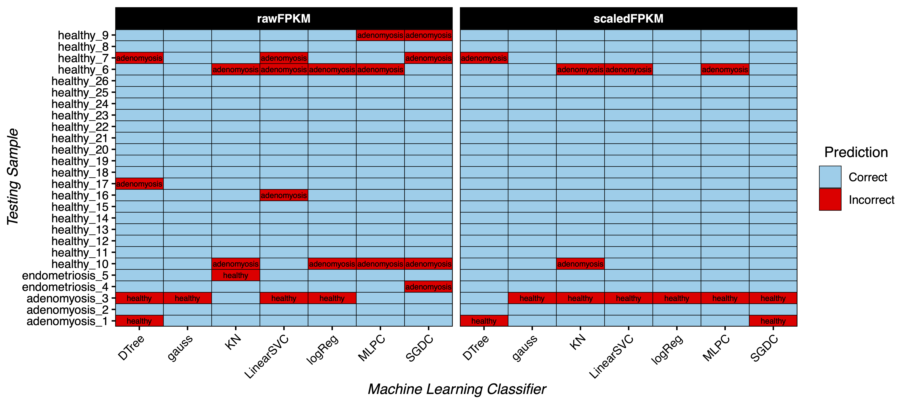

# ABSTRACT
This github repository is a proof-of-concept showing the predictive and diagnostic utility of applying machine learning techniques to endometrial transcriptomic data. **All** human endometrial transcriptomes generated via high-throughput sequencing and available on the NCBI-GEO repository were used to train and test this model. This model is limited in its scope by the low number of available samples. Despite this, some ML models are still able to provide a strong prediction of the test data. This project was conducted exclusively out of personal interest and a desire to gain some hands-on experience with machine learning.

# INTRODUCTION
Endometriosis and adenomyosis are common uterine inflammatory diseases associated with chronic pain and infertility [1,2]. For endometriosis in particular, diagnosis often involves invasive laparoscopic surgery as it currently has no reliable biomarkers. AI techniques have been previously successfully tested as predictive diagnostic tools for endometriosis [3], though these are mainly used for medical image analysis. Machine learning techniques have also been previously applied to identify markers of endometriosis in peripheral blood, but notably this study's healthy controls had all previously given birth and may be a biased control set [4]. Broadly, machine learning approaches appear largely accurate for detecting endometriosis by meta-analysis [5], even simply applying ML techniques to clinical questionaires appears to have predictive diagnostic capability [6]. However, to my knowledge, no ML algorithms have been published that use endometrium transcriptomes to predict endometriosis and/or adenomyosis status or risk. Herein, I provide a proof of concept to determine whether this would be possible.

# DATA COMPOSITION
This training set uses all publicly available high-throughput RNAseq datasets conducted on the human eutopic endometrium. Datasets used in this study were made public on the NCBI's GEO database between 2018 and 2025, and contain samples from patients with endometriosis (2 studies), adenomyosis (3 studies), or otherwise healthy patients experiencing uterine fibroids, HMB, infertility, or no reported pathology (5 studies).

## Table 1
| Study     | Year | nSamples |
|-----------|------|----------------------|
| GSE102131 | 2020 | healthy, n=20 |
| GSE106602 | 2020 | healthy, n=70 |
| GSE185392 | 2022 | healthy, n=10; adenomyosis, n=10 |
| GSE190580 | 2023 | healthy, n=5; adenomyosis, n=6 |
| GSE220044 | 2024 | healthy, n=11 |
| GSE228005 | 2023 | adenomyosis, n=5 |
| GSE282532 | 2025 | endometriosis, n=5 |
| GSE99949  | 2019 | endometriosis, n=4 |

In total, these data include 147 samples of pre-menopausal adult women with reported ages ranging from 21 to 43. These samples were collected across multiple continents and comprise patients of multiple ethnic backgrounds. These samples were collected at a variety of menstrual stages. Of this 147, there were 9 available endometriosis samples collected through endometrial biopsy and hysteroscopy during both the proliferative and mid-secretory phases of the menstrual cycle. There were 21 available adenomyosis samples collected through endometrial biopsy and hysterectomy during both the proliferative and mid-secretory phases of the menstrual cycle. The remaining 117 healthy controls include fertile and non-fertile patients, some of which were undergoing concurrent IVF. Samples were collected by both hysterectomy and endometrial biopsy, and were collected during the proliferative, periovulatory, and mid-secretory phases of the menstrual cycle.

# METHODS
Raw or FPKM count matrices were pulled from GEO for all relevant samples. The values of duplicated genes were summed. Raw counts were converted into FPKM, and all FPKM values were scaled within each sample. Genes were converted to ENSEMBL IDs for consistent merging, and those genes present in 4 or fewer source datasets were removed from the training data. Remaining NaN genes were converted to 0 counts.

Due to low data availability, only 2 and 3 endometriosis and adenomyosis samples respectively were set aside for testing (n=1 from each source experiment, randomly selected). 21 healthy control samples were set aside for testing, semi-randomly sampled (manually modified random selection to be more equally split across source datasets and metadata variables). The remaining samples were used to train a variety of common machine learning classifiers: stoachastic gradient descent (SGD), logistic regression, KNeighbors, linear support vector machine (SVM), decision tree, RandomForest, guassian process classification (GPC), and multi-layer perception classifier (MLPC). Models were trained on both the scaled and unscaled FPKMs separately.

# RESULTS
After model training, the samples set aside for testing were supplied back into the model. In this limited sample size, it appears possible to predict endometriosis correctly using nearly any classifier, while adenomyosis appears more prone to false assignments (Figure 1). Due to the limited testing cohort size, it is not possible to conduct a meaningful statistical analysis on these testing cohort results. However, qualitatively, it appears that GPC and the logistic regression classifier appear to have the best predictive ability when used on scaled FPKM values.

## Figure 1

# DISCUSSION
This model is limited in its scope by the low availability of bioinformatics studies conducted on the human endometrium. Across all species and modalities, only 209 studies matching the keyword "endometrium" host data on the NCBI-GEO repository. These 209 comprise all species and sequencing modalities. Regardless, even with this extremely limited training set we see decent predictive capacity for adenomyosis, and strong predictive capacity for endometriosis. Notably, in most cases, prediction errors with adenomyosis appear to be caused by the samples from GSE185392. These samples were collected via endometrial biopsy, whereas the other studies collected adenomyosis samples via hysterectomy. A more robust and variable training set would likely lead to better predictions.

# REFERENCES
1. Philippa T K Saunders, Andrew W Horne, Endometriosis: new insights and opportunities for relief of symptoms, Biology of Reproduction, Volume 113, Issue 5, November 2025, Pages 1029–1043, https://doi.org/10.1093/biolre/ioaf164
2. Santulli P, Vannuccini S, Bourdon M, Chapron C, Petraglia F. Adenomyosis: the missed disease. Reproductive BioMedicine Online. 2025;50(4):104837. doi:10.1016/j.rbmo.2025.104837.
3. Dungate B, Tucker DR, Goodwin E, Yong PJ. Assessing the Utility of artificial intelligence in endometriosis: Promises and pitfalls. Women’s Health. 2024;20. doi:10.1177/17455057241248121
4. Su D, Guo Y, Yang R, Fang Z, Lu X, Xu Q, Teng Y, Sun H, Yang C, Dong J, Yu H, Mao J, Yu L, Zhao H, Wang X. Identifying a panel of nine genes as novel specific model in endometriosis noninvasive diagnosis. Fertil Steril. 2024 Feb;121(2):323-333. doi: 10.1016/j.fertnstert.2023.11.019. Epub 2023 Nov 22. PMID: 37995798.
5. Zhang B, Lv X, Li D, Zhang L, Ru Z and Ma Y (2026) Diagnostic accuracy of machine learning for endometriosis: a systematic review and meta-analysis. Front. Endocrinol. 16:1735567. doi: 10.3389/fendo.2025.1735567
6. Bendifallah, S., Puchar, A., Suisse, S. et al. Machine learning algorithms as new screening approach for patients with endometriosis. Sci Rep 12, 639 (2022). https://doi.org/10.1038/s41598-021-04637-2
